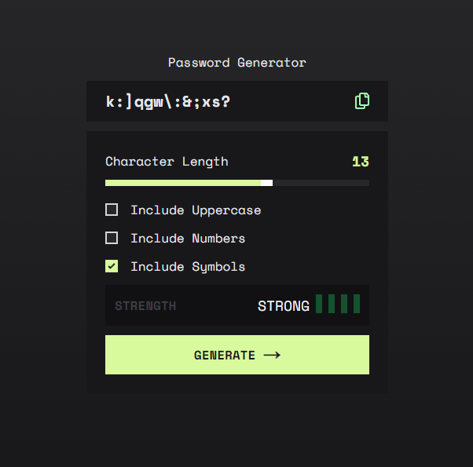

# Password Generator

Password Generator is a simple app that generates a random password based on the user's input.

[Live site](https://password-generator-facuperezm.vercel.app/)

## Screenshots

## Tech Stack

**Client:** React, Next.js, Tailwind CSS

**Deploy:** Vercel

## Optimizations

- [x] Responsive layout (mobile/tablet/desktop)
- [ ] Dark/Light theme
- [ ] Improve strength functionality
- [ ] Improve password generation algorithm
- [ ] Work on UI details

## Acknowledgements

- [Tailwind CSS Docs](https://tailwindcss.com/docs/installation)
- [Next.js Docs](https://nextjs.org/docs/getting-started)

## Author

- [Facundo Perez Montalvo](https://facuperezm.com)

